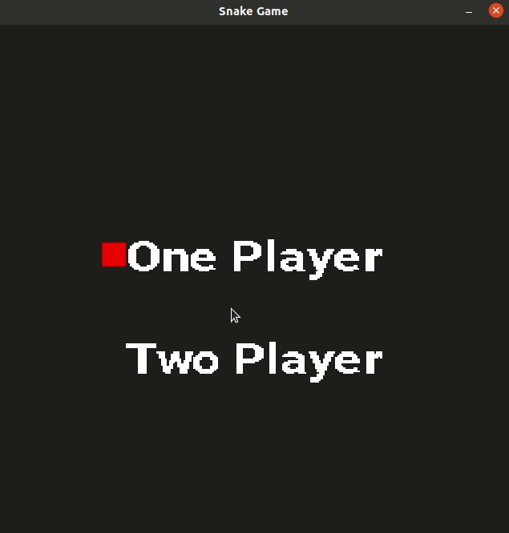

# CPPND: Capstone Snake Game Two Player Extension
This is my capstone project for the Udacity C++ Nanodegree. I have chosen to extend the snake game by making an optional two player mode which the user can enter by selecting from a start menu. The gif below shows how the game play works. 
- First the user selects one or two player mode using the arrow keys (up and down). 
- One player mode functions as before, but in two player mode, there are two snakes.
- One snake (the blue snake) is controlled by the arrow keys
- The green snake is controlled by w,a,s, and d keys. 
- The snakes can't be killed by collisions with each other, but will still be killed by a self collision. 
- The game is played for two minutes. At the end of two minutes, whoever has the highest score wins. This is printed to the terminal when exiting the game.

## Dependencies for Running Locally
* cmake >= 3.7
	* All OSes: [click here for installation instructions](https://cmake.org/install/)
* make >= 4.1 (Linux, Mac), 3.81 (Windows)
	* Linux: make is installed by default on most Linux distros
	* Mac: [install Xcode command line tools to get make](https://developer.apple.com/xcode/features/)
	* Windows: [Click here for installation instructions](http://gnuwin32.sourceforge.net/packages/make.htm)
* SDL2 >= 2.0
	* All installation instructions can be found [here](https://wiki.libsdl.org/Installation)
	* Note that for Linux, an `apt` or `apt-get` installation is preferred to building from source. 
* gcc/g++ >= 5.4
	* Linux: gcc / g++ is installed by default on most Linux distros
	* Mac: same deal as make - [install Xcode command line tools](https://developer.apple.com/xcode/features/)
	* Windows: recommend using [MinGW](http://www.mingw.org/)
* TTF fonts
	* `sudo apt-get install libsdl2-ttf-dev`

## Basic Build Instructions

1. Clone this repo.
2. Make a build directory in the top level directory: `mkdir build && cd build`
3. Compile: `cmake .. && make`
4. Run it: `./SnakeGame`.

## Rubric Points Completed
**Required Points**:

	- `README with instructions is included` -> this is the readme
	- `README indicated which project is chosen` -> My readme indicates the snake project was chosen and describes gameplay at the top of this README
		- In terms of code structure, the original structure of the repo is the same as the original snake game with one additional class (PlayersMenu) which is used by the renderer class to render the select number of players menu before game play begins.
	- `README indicates which rubric points are addressed` -> See Below
	- `The submission must compile and run` -> See the Basic Build Instructions above to build and run the project

**5+ Rubric points addressed by my project**:
1. `The project demonstrates an understanding of C++ functions and control structures` -> In `game.h`, I created a vector of snakes on line 18. Then in `game.cpp` on lines 39-40 I populate the vector with either one or two snakes based on the user input. I then adjusted the inputs to the `HandleInput`, `Render`, and `UpdateWindowTitle` functions to take the new vector as an input. Then I loop over the vector to perform the various tasks. One example of this is in `renderer.cpp` on line 76 when I use a range based for loop to iterate over the vector.
2. `The project accepts user input and processes the input` -> In `Game.cpp` lines 21-42, I created a loop which calls a couple new functions I created to process user input (selecting a 1 or 2 player game). These functions are `SelectPlayerCount` on lines 67-90 of `controller.cpp` and `RenderPlayerSelectMenu` on lines 129-172 of renderer.cpp. These functions handle the player inputs to the startup menu and then render that startup menu.
3. `The project uses Object Oriented Programming techniques` -> I created a new class `PlayersMenu` (see playersmenu.cpp and playersmenu.h) to populate and get the player selection textures.
4. `Classes use appropriate access specifiers for class members` -> In `playersmenu.h` I created public member functions (getters and setters), and private date members.
5. `Class constructors utilize member initialization lists` -> I added several variables to the `Game` class in game.cpp, and then initialized them in the member initialization list on lines 7-15.
6. `Overloaded functions allow the same function to operate on different parameters` -> In the `PlayersMenu` class, I the functions `OnePlayer` and `TwoPlayer` are overloaded based on the inputs and used to either set or get the textures.
7. `The project makes use of references in function declarations` -> In `controller.h` lines 8 & 9, I pass the arguments of `HandleInput` and `SelectPlayerCount` by reference. I do the same on lines 17-19 of `renderer.h`. Additionally, in the `PlayersMenu` class instead of passing the SDL_Testures by value, I pass a pointer to them.
8. `The project uses smart pointers instead of raw pointers` -> In the `PlayersMenu` class I use unique_ptr for the one and two player textures (see lines 19-20 of `playersmenu.h`).
